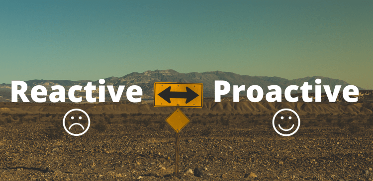
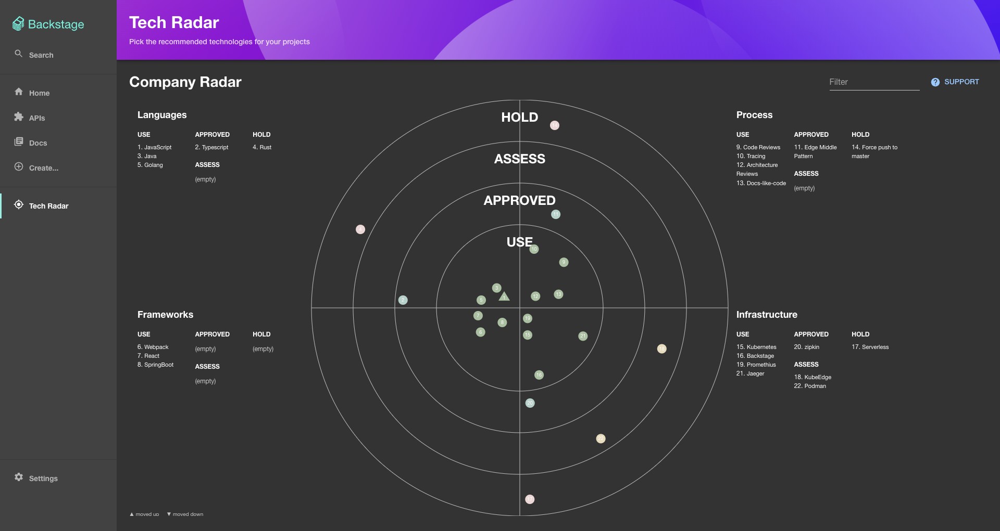
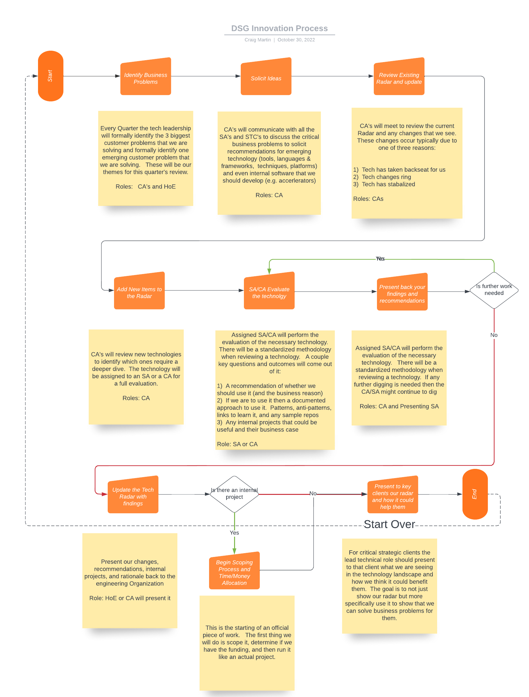

# DSG Innovation Strategy

 

 
 
 
 

We all agree that we want to be more proactive when it comes to our customers.  Our innovation strategy is a critical component of that strategy.  It will get us regularly looking out into the technology landscape, develop opinions on the proper approach, and have clearer communciation into our organization.

Critical Benefits:

1.  **Culture of Innovation** - Keeps us looking out to the technology landscape so that we are proactively enaging with the correct emerging technology.  DSG engineers watch what we do and will mimic our behavior.
2.  **Clear Guidance to DSG** - Provide guidance and direction to all DSG engineers on our vision 
3.  **Documented Opinions and Approaches** - Document our opinions and approaches on critical technology.
4.  **Innovation Offering** - Present back to critical customers our vision and how it could help them

## How we do it

We are going to keep an active technology radar and a process of regularly maintaining it.  

Measureable Deliverables with the process:

1.  **Quarterly Technology Reviews** - Quarterly presentations back to the business of what we are seeing in the marketplace and what technology can support
2.  **Quarterly Skills Gaps** - Quarterly presentations on areas where we can improve as an organization
3.  **Internal Projects** - Identification of internal projects 
4.  **Knowledge Base** - Documentation of our patterns, anti-patterns, training plans, and benefits and drawbacks
5.  **Innovation Presentation** - Routine presentations back to our key clients on our tech radar and how it could pertain to them.  Could be powerful in an EBC.
6.  **Client Offering** - A key component of our technology strategy offering for our customers (e.g. We set up this process for them)

 

 
 
 
### What is isn't

Before we dig deep into how we innovate ourselves through a technology radar it is important to understand what it isn't.

- **The technology radar is NOT a tool, it is a process!**
- It is not a place to list all of our tech that we work with.  This isn't an ego fest
- It is not just limited to tech libraries.  It is intended to be for anything tech related (tools, languages & frameworks, techniques, and platforms)
- It is not a static tool, it should be living and breathing

### The Process

Below is the Quarterly process of monitoring and innovating through a technology radar.  This will ensure that are regularly visiting our radar, looking into the collective consciousness of our organization, and consistently challenging ourselves.

 

 
 
 
### Tech Review Template

In an effort to standardize the technology review approach a separate template will be used to review any technologies.  For the latest template click [here](https://github.com/mornindew/tech-radar-json/blob/main/Technology/Technology/template/template.md)

### Key Ancillary Outcomes

Working an innovation strategy like this will have a couple core benefits as well.

1.  Helps in hiring - a place that is consistently monitoring the tech landscape will be more desirable to technologists
2.  Helps in communcation and will help us to scale

## Badge Board (INCOMPLETE)

The logical next step of any organization who is communicating through a tech radar is to know the collective consiousness of the employees within that organization.   This is where the badge board can come into play.   It is essentially a list of all our employees and their skills.  There are a couple core use cases for a badge board:

- A way for an employee to find a resource who can help them with a specific skill
- A way for technical leadership to see the collective consciousness of the organization and areas that we need to grow
- A clear path for employees to measure what skills they have learned

