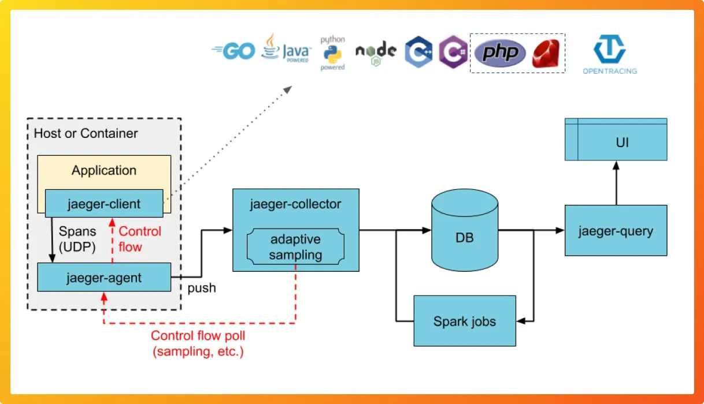

# Distributed Tracing

Distributed Tracing is a critical part of any cloud based implementation.  Our opinion is that tracing should be included in any architectual patterns that leverage distributed computing.  The point of tracing is to provide insights as individual calls go from one component to the next.  It is often very easy to see what is happening within a single component but more difficult to see it when the calls are hopping back and forth from component to component.

## Business Benefits

1)  **Time Savings** - Any organization without tracing will lose lots of time (and money) trying to debug issues in any of their applications (production and lower environments)
2)  **Cross Team Collaboration and Faster development** - often different teams own different services and this helps each respective team to understand their role in the issue and allows teams to work faster

# Overview - How it works

The way that tracing works is by attaching a trace ID to every unique calls that comes into the system.  From there that trace ID will stay with the call throughout it's entire journey.  Normally some logic will be applied to determine whether the trace record should be recorded or not.  If it is recorded then it will be put into a database.

<br>

<br>
<br>
<br>

## Sampling

Tracing works by sampling specific calls, this is very important as it will keep costs down but also not slow down the system too much.  There are four very common samping algorithims:

1.  **Always** - This is used when you sample 100% of the calls coming in.
2.  **Never** - This is used when you sample 0% of the calls coming in.  
3.  **Probalistic** - This is done on the individual call on the rate of a coin flip, you can specify the liklihood
        <br>
        ```
        theSampler = trace.ProbabilitySampler(1/1000.0);
        ```
# Technolgy Choices

There are many choices when it comes to tracing:

- **Jaeger** - [Jaeger Tracing](https://www.jaegertracing.io/) - is a very robust open source tracing collector written in Go.  It also is adapting to Open Telemetry.
- **Zipkin** - [Zipkin](https://zipkin.io/) - is a very powerful tracing tool that is a bit older.  It works very similar to Jaeger but is written in Java.
- **Cloud Trace** - [GCP Cloud Trace](https://cloud.google.com/trace) - If your application is 100% GCP native and the customer isn't worried about being cloud agnostic then Cloud Trace is a good option.  It also supports Zipkin collectors
- **AWS XRay** - [AWS Xray](https://aws.amazon.com/xray/) - if your application is 100% AWS native and your customer is ok with leveraging cloud specific tooling then XRay is a very powerful option.
- **Azure Monitor** - [Azure Monitor](https://learn.microsoft.com/en-us/azure/azure-monitor/app/distributed-tracing) - Azure Monitor can do many things more than just distributed tracing but it is capable of doing tracing as well.   If you are already using Azure Monitor and your customer is on Azure then you can use Azure Monitor for your distributed tracing.

## Patterns and Anti-Patterns

|     Name                  |Pattern                        |Anti-Pattern                 |Rationale   |
|---------------------------|-------------------------------|-----------------------------|------------|
|Using Never Sampling Rate |Even if your sampling rate is low you should have some sampling going on            |Not collecting any data for tracing is bad            |This will not give you visibility into how your production environment is running|
|Using Always as a Sampling Rate                     |Only use Always as your sampling rate if it is a lower environment and the traffic is very low|Enabling all tracing to be turned on | This will have large cost implications and storage issues            |
|Probalistic Sample Rates                     |Prefer Probalistic Sample Rates and have lower sampling rates the higher the environment|Not adjusting the sample rates per environment| this will keep costs lower            |
|Storing Sampling Rates in Application Code | Ideally Changing Sampling Rates should not require a full application deploy | requireing a full application deploy to change sampling rates | this will add more variables in diagnosing issues as you are actually deploying a different version|
|Storing Sample Rates in your Service Code|  Store your sample rates in a single location for your entire system or application| Having different sample rates per service| This can create confusion as different components are sampling at different rates.  It also makes is hard to change as the update needs to happen in the service code.|


## Training Materials

- [Jaeger](https://www.jaegertracing.io/docs/1.38/getting-started/)
- [Zipkin](https://zipkin.io/pages/architecture.html)

